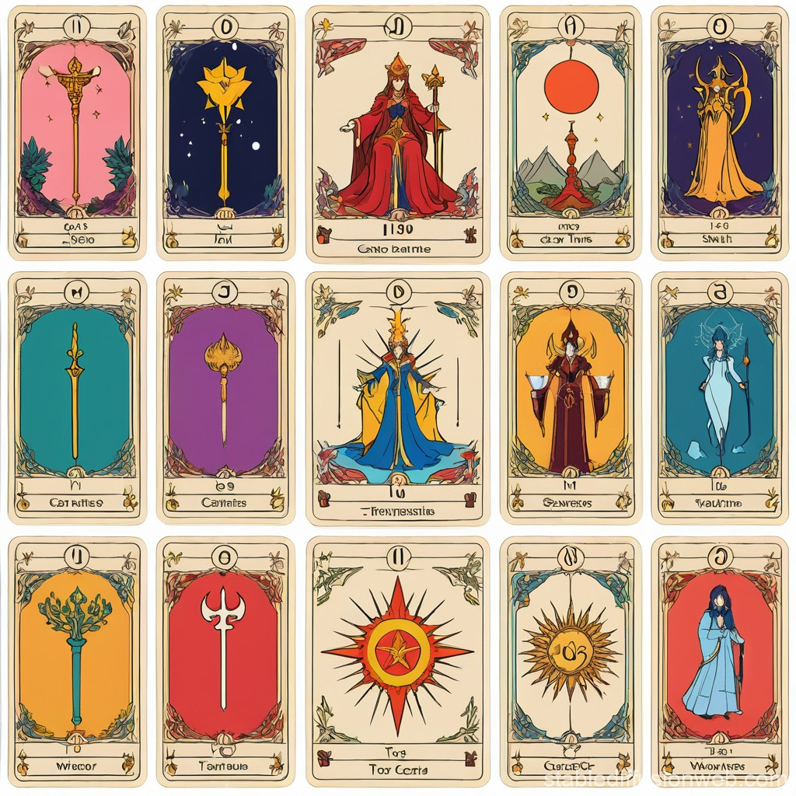

# Adapting Local LLm to a Specific Use Case

> *I humbly bow to the ancient Yoruba pantheon, whom departed their bodies to hold congress in the spiritual realm, providing a binary code for humanity to hold communion with the spiritual and outer realms. Similarly, I invoke the Blessed Carlos Acutis, first Patron Saint of the new millenium, in the hope of echoing the civility, discipline, and wisdom beyond years demonstrated through his writing and regarding the relationship between human and technology.*

 *"The Fool" card of the Tarot Deck Major Arcana, retro-futuristic, "clairvoyance meets technology" custom theme*

***
### _Intro_

For some time now, I have been thinking about building the ideal pair programming companion -- one trained on the foundational wisdom of the Software Engineering discipline. But the more I thought about it, this idea betrays an underlying complexity that would be difficult to address in a first-time project because it requires capturing the nuanced support of an actual human interaction. This led me to to pivot to another great idea for a project that would teach me the inner workings of Large Language Models and explore areas that hold my curiosity (AI, symbolism and human experience): tune an LLM to give readings using ancient art of Tarot.

The idea I have is to use an LLM that runs locally on my hard drive, with an existing, configurable model that has been pretrained, and to run additional training from a narrower dataset with the goal of adapting it to a more specific use case. User prompts would be the same way someone might prompt a fortune teller: things like, "Whom will I marry?" or "Will I ever be rich?". The LLM assistant could be prototyped as something relatively surfaced (not too deep), more like a game of MASH than a ancient oracle. I will work in iterations to slowly build something more nuanced and meaningful.

How does one approach a project like this? Does it require building an assistant
or is it more-training a model? Let's unpack the answer from the point of view of **software and machine learning architectures**.

***

## **Requirements Definition (MVP)**

**Create an LLM-powered tarot card reader** with the following traits:
- Understands distinct meaning for each of the 78 cards found in a standard Tarot deck  
- Can be **queried** on specific, personal matters and provide interactive and personal readings 
- Understands symbolism and incorporates it into reasoning
- Reads both language and imagery and incorporates both into responses
- Chooses layout or "spread" based on context of user's query. 
- Can give readings using the following spreads:
    - **One-Card Spread**: _Yes/No questions or quick insight_
    - **Three-Card Spread**: _past, present, and future_
    - **Celtic Cross**: _in_depth readings that cover multiple levels and aspects_
    - **Seven-Card Horseshoe**: _Connects aspects of a problem, including hidden influences and likely outcome_
    - **Blind Spot**: _A 4 card spread for enhancing self-awareness_ 
    - **Ankh**: _For questions about causes behind trends_
    - **Relationship**: _Spreads for questions about personal relationships__
- Can apply the ideal reading or spread according to the user's query

***

#### More About Tarot
 "Tarot cards"

***
> Each Tarot Deck contains a total of *78* cards: **22** cards of the _Major Arcana_ and **56** of the _Minor Arcana_.

> Tarot Cards predate modern playing cards.  In fact, the modern deck is derived from Tarot, or more correctly, all playing cards used to be Tarot decks. Tarot's Minor Arcana mirrors a modern deck with 4 suits of 13 cards, except that each of the 4 tarot suits contain a total of 14 cards because there are 4 face cards instead of 3: Jack, Queen, King, and Knight.

The card suits available vary between decks depending upon their country of origin.  For a deep dive on this topic, head to Wikipedia's [Playing card suit](https://en.wikipedia.org/wiki/Playing_card_suit) article.

##### *Playing Card Suits by Region*

| **French** | **Latin** |
| -------- | -------- |
|||


## Three Approaches for building an LLM-powered Tarot Card Reader

### #1: Orchestrated Assistant

Using an approach called _LLM Orchestration_ or _Agent Building_, use an existing LLM like GPT-3, Llama 3, or Deep Seek and apply configurations for
system prompts, remembering context, and customized learnings.

**System prompts**: _Defines tarot knowledge and reading style_

**Context memory**: _Database or document store retrievals_

**Custom embeddings**: _Trains on tarot card meaning and interpretation according to context (e.g., nature of query, chosen layout or "spread")_

Orchestration does not train a model, but instead teaches and shapes it. 

#### Orchestration Model Components with Description
- **Orchestration and Retrieval Device**: Uses tools like **LangChain**, **LlamaIndex**, or **Semantic Kernel** to orchestrate reading flow, from layout choice to card+layout interpretation.
- **Vector Database**: Data storage from database tools like Pinecone, Chroma, Weaviate, etc. to store tarot card and layout data 
- **Frontend UI (web and/or mobile)**: Acts as conduit for readings, where tarot reqader responds to user queries

#### Orchestration Approach Analysis

Pros
- Relatively inexpensive 
- Quick to prototype
- Naturally modular (allows easy substitution of LLM base model)

Cons
- Heavily dependent on external APIs
- No “native” understanding (personality will be simulated, not embedded)

### #2: Fine-Tuning/Training Approach 

_Fine-tuning_ an existing, open-source base model (e.g., llama, deepseek, etc) means training it on additional sets of large data, like tarot card guides, deck manuals, symbolism dictionaries, transcribed, real-world readings, and description metadata from tarot image sources.

Pulling this off requires first establishing a **tarot corpus**, which, in AI, means a large and structured collection of texts used to linguistically train models.  A _corpus_ is the most fundamental knowledge on which Large Language Models is based. This _tarot corpus_ refers to the a customized knowledge base on which the model is fine-tuned. This is what gives the LLM the ability to provide coherent and accurate tarot card readings. The corpus is comprised of knowledge from various resources and covers a wide breadth of cultural and geographical references, crucial for understanding context, "vibe", and basis. 

Fine-tuning models encompasses a couple of different approaches and a variety of techniques, and without getting too heavy into these distinctions, understand
that the goal of fine-tuning is to purpose an existing model for a specific use-case. Fine-tuning can be accomplished using tools like **HuggingFace** or **Axolotl** and range from expensive to very expensive. It also requires curating massive datasets and consumes an enormous amount of energy.

Using this approach is more likely to _feel_ like a genuine tarot AI and less like a disembodied head on the boardwalk in Coney Island or the slip of paper from the complimentary cookie in your last takeout meal at Panda Express. It would also be capable of running fully offline.  Its personality would be more flexible and could be more carefully cultivated and shaped.

Not only is this approach expensive, it is time-consuming.  It requires having a sophisticated ML infrastructure and implementation for cleaning data.
This is also difficult to maintain as retraining would be needed continuously for improvement. In reality, it would involve a team or even a department, not a lonely but curious programmer and their pair programming AI (oh wait... we don't have that yet).

### #3: Vibe Coding

“Vibe coding” is a concept from the AI creator community that refers to **aligning an AI’s tone, aesthetic, and emotional resonance** rather than its factual or logical accuracy.

In practice, "vibe coding" means designing **prompt archetypes** and **stylistic anchors**, defining **personality layers** which adapt to user energy or inquiry, and using **few-shot examples** or **synthetic dialogues** to shape something like its “spirit.”  

#### Common Prompt Archetype

Role-Task-Format
```
You are a [role].
[Task description].
Output format: [specified format]
```

#### Stylistic Anchors
**definition**:
_Specified reference points provided within a prompt to guide AI output tone, voice, etc. Uses descriptions or concrete examples to produce desired style and tone of output, instead of general characterizations._

**characterization**: _'maintain a casual tone', or 'write professionally'_ 

**anchoring description**: _'write like Malcom Gladwell - story-driven, accessible and with surprising insights'_


#### Personality Layers
Dimensions or levels of characteristics built into a model's response protocol as a multi-faceted personality. Like a _Persona_ used to define use-case, but with more depth and authenticity established through addressing of multiple layers.

```
  columns 6
  a["communication"]
  b["emotion"]
  c["expertise"]
  d["interactional"]
  e["values/perspective"]
  f["cognitve"]
  g["Layers"]:6
```

#### Few-Shot Learning
Input-Output pair examples + new input

```
Input: [example 1] -> Output: [result 1]
Input: [example 2] -> Output: [result 2]
Now: Input: [your actual query]
```

Using vibe coding as an approach could capture a tarot reading well, while also allowing for a more flexible and creativity-based project, one that doesn't require having deep pockets or plenty of free time.  It is more an art than a science, and uses lots of iteration.  On the downside, the base model would be at risk of experiencing "drift" from its intended vibe over time, and resource management and scalability could become an issue later as well, but only if demand were to skyrocket.

My approach will most likely borrow a little from each approach, and will be perfected using incremental iterations. 

You can check out my project blueprint below, which includes a four-phase action plan with bullet points.  This is also available online as a GitHub Iterative Project at https://github.com/users/k8port/projects/11/views/6[Iterative Project].

## 4-phased plan
### **Phase 1: Prototype assistant**

* Build an orchestrated assistant with multiple tarot decks in a vector store.
* Use structured prompting and vibe coding to differentiate decks.
* Stack is LangChain + GPT API + Pinecone + lightweight web UI.

### **Phase 2: Gather readings**
* Log and curate readings with feedback to create a proprietary dataset.

### **Phase 3: Fine-tune**
* Fine-tune small open model (e.g., Mistral-7B) using data.
* Bake in a “multi-deck” tarot corpus and align it stylistically

### **Phase 4: Optional multimodal**
* Integrate image recognition to allow card image uploads.
****

_Due to the advanced age of this universe, its immensity and my nothingness against it,  furthered by the limits and entrapments imposed by humanity, the ideas expressed in this page are done so with the humble acknowledgement of falling short of totality. The intent is to share curiosity and reveal structure of thought, if not to sharpen this skill._