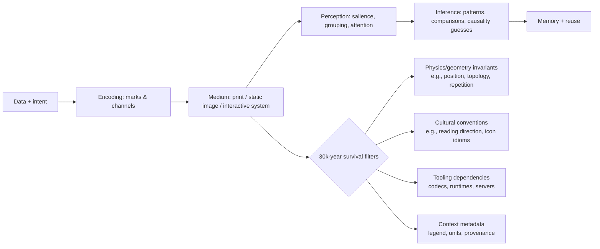

# Information Graphics through a 30,000‑Year Lens

 In art school, a teacher once made a significant impression on me through a simple assignment. Consider the following design problem:
 """
   Imagine you work for a corporation that has discovered a solution to global warming, world hunger, or something equally devastating. The byproduct of the process solving this problem is a giant, toxic waste dump. A board of top minds have been assembled to decide how to dispose the waste: it would be buried deep, deep underground -- so deep, in fact, that it would not be expected to resurface until another 30,000 years passed.  Your job is to design the warning sign for the lid of the dump, to warn the inhabitants of Earth in this distant future. We have no idea what language they will speak, what their culture and customs will be like, or even if they will be human. How would you design a sign that communicates the very important message to not remove the lid of the underground vault?
"""

Information graphics work best when *structure* is compressed into into *perception*.  The mind quickly recognizes quantity and relationship when it is represented by count, position, and sizing. Typical left-brain activity like calculating and analyzing are secondary to what is absorbed intuitively by the "right" brain.

For future civilizations, it is definitely less important how attractive this sign is, because the graphic contains a dire warning whose meaning is crucially understood.  Choose encodings with posterity, with meaning that survives an indefinte period of time into the future, and decodable by an unknown intelligence.  Taking on an imagined perspective 30,000 years into the future forces us to recognize the nature of reality--that both things are true! Some ideas will pervail and others will perish but for reasons that are both vital and mundane.  Geometry and physics continue to have perceptual salience and remain legible even when language and culture vanish. Visual representations on which we have hung our hats (charting, iconograpy, design systems) are significantly more frail, because they depend on conventions of now.  Without the context of the present, ideas dissipate into decorative noise and norms become hideous aberration (quicker than you can say "Puff Daddy").

Durable strategies come up when examining current and historical records:

* ***repetition representing quantities*** _Isotype pictograms_
* ***spatial positioning to indicate magnitude*** _charts/maps_
* ***topology showing connection*** _networks_
* ***descriptive redundancy*** _legends, scales, reference units_

They persevere because they piggyback on an inherent mammalian ability to detect positional difference, to intuit natural grouping, and to recognize symmetry, continuity, and motion sub-consciously. As long as future intelligence retains the same, these strategies remain valid. 

According to a study published on behalf of 
Taylor & Francis, Ltd. for the American Statistical Association in September of 1984, graphical perception among diverse populations showed that *position on common scales* (placing data points across a single, shared axis) are perceived more accurately than formulaic encodings like length, angle, and area represented graphically (geometry). Further, Feature-Integration Theory, as described in the 1980 article in Cognitive Psychology by Anne M. Treisman and Gary Gelade, posits that some graphical features “pop” for cognitive recognition, like distinct hues, orientation, or motion.  Both observances signifcantly useful to consider in Graphic Design, but the later theory less so because it depends on current context.

Designers and Archivists in 2026 must be vigilant in awareness for the true cost of features like interactivity, animation, and platform-specific stylings.  These features are inherently luxurious, and should always be treated this way.  Do not place all record in luxury resources.  Treat self-describing, redundant encodings, and open-format artifacts as primary. Beware of false confidence!  Learn to recognize it and weed it out. Standards and preservation frameworks like OAIS, WARC, and PDF/A coupled with the principles and practices of fixity, replication, and emulation do wonders bar are not magical preservers of meaning.  Meaning survives only when **context** is preserved _deliberately_.

## Cross-cultural and cross-media information onf Grapics from simple to Complex

A 30,000‑year observer will not care whether something was called an “infographic.” They will care whether the artifact reveals *invariants*, most important to the subject of graphical meaning for posterity, invariants are, "_...functions, quantities or properties that remain unchanged after undergoing various transformations."_ (see _Invariants: The Mathematical Way to Look at the World_,"2019"). Invariants contribute “physics” to the study of information graphics, adding perceptual and physical properties likely to survive cultural and linguistic change.

Some of the most intriguing examples are described briefly below and have the common trhread of being encoders of information in robust ways and loss-resistent.

### Case Study #1: Khipu Trandition, Andean Mountain Range, South America
The Andean khipu traditon for using **Knotted, tactile, and data-dense records** was documented by UNESCO's _Memory of the World_ database.  It describes the Andean khipu tradition tha iiiqpjqqged to represent sole, surviving record for South American Incan empire.  It shows the systematic use of knots, cord colors, and structure to record information across many surviving objects. Its degree of _readability_ depends on embodied interaction and learned conventions, but *physical redundancies involving multiple material dimensions* increases its chances of remaining at least  partially decodable even after all modern language is lost.

.Khipu Knot Tradition
****
image::https://upload.wikimedia.org/wikipedia/commons/thumb/0/0e/Khipu_Quipu.jpg/2560px-Khipu_Quipu.jpg[caption="Khipu: knotted cords encoding information. The physical structure and material properties provide multiple channels for meaning, increasing the chances of partial decodability over deep time. Source: Wikimedia Commons."]
****

.Marshallese Stick Charts
****
**Geometrical Models of Navigation** Marshallese “stick charts,” held in collections including, "The M.Marshallese Stick Chart set at Metropolitan Museum of Art","New York, NY, US", encode wave patterns and island relationships in a sparse lattice of sticks and shells. Even if the cultural practice is lost, the object still screams “graph-like structure” (nodes/relations), which is exactly the kind of form a future intelligence could reverse-engineer.
****

.Tablular-prediction Astronomy
****
Recent scholarship analyzing the Dresden Codex eclipse table emphasizes structured sequences and corrections—evidence of a predictive, model-based information system. Even if glyph semantics are lost, periodic structure and error-correction marks may remain legible as “prediction machinery.”
****

.Geometry of Quantities
****
 In modern graphics: **The 18th–19th century European canon—time series and bars associated with Physicist's William Playfair's polar area diagrams and flow maps like those created by Charles Joseph Minard", _civil engineer & cartographer_. Napoleon's campaign graphics—persist _because they map quantities onto space in ways that don’t require language to notice patterns (surges, collapse, asymmetry, loss).
 ****

.Pictorial standardization
****
ISOTYPE, developed by Otto Neurath,"isotype pioneer" and collaborators, explicitly aimed to make “social facts” pictorial through consistent symbol rules (e.g., quantity by repetition and not scale). That design choice was a deep move: repetition is a high-likelihood universal.

## Visual System Principles and Affordances toward the survival of interpretation

A useful 30,000‑year heuristic is: **what can be recovered from the artifact without shared language, shared UI conventions, or shared institutions?** This pushes you toward perceptual/physical affordances.

### Iconography, marks, and channels

In visualization theory, a recurring foundation is that information is encoded into marks (points/lines/areas) and channels (position, size, color, etc.). Jacques Bertin, cartographer semiology, imagined something he called “visual variables" which included position, size, value/lightness, texture, color/hue, orientation, and shape. His work is influential precisely because it ties design to perceptible differences rather than stylistic preference. 

### Motion and interactivity

Interactivity is powerful *now* but is also preservation-hostile because it depends on executable environments. Ben Shneiderman, hci researcher", composed what he dubbed a “visual information-seeking mantra”, which captures the cognitive logic of interactive exploration. Yet still, in 30,000 years, prediction on the nautre of interactions is not likely to be unreplayable unless you preserve software and environments.

Animation can clarify change when it preserves object constancy. Work on animated transitions (e.g., by entity["people","Jeffrey Heer","computer scientist visualization"] and collaborators) frames principles for using motion to help viewers track correspondences. citeturn4search1turn4search13 For deep time, treat animation as **optional explanation**, never as the only record.

## The Unusual, the concise, the elegant, and the surprising: Techniques to Employ in 2026

This section emphasizes formats that communicate *variable complexity*—a quick gist at first glance, but deeper structure on inspection—while also noting what likely survives wordlessly.

**Micro-visuals as “inline evidence”:** Sparklines compress time-series shape into word-sized marks, allowing local evidence to travel with text/tables. They are unusually durable because a line’s shape reads as “variation over sequence”, even without labels, though the *meaning inherent to the axis* may be lost if units are omitted. 
*Caption:* **Sparkline:** a minimal time-series signature embedded where reading happens.

**Horizon graphs and layered compression:** Horizon graphs fold and color-layer time series to increase density; experiments compare accuracy tradeoffs as size shrinks. This is elegant but semantically fragile: without a legend explaining banding and mirroring, a future reader may only see decorative stripes. 
*Caption:* **Horizon graph:** sacrifices immediate intuitiveness to fit many time series into small vertical space.

**Glyphs exploiting human face-processing:** Chernoff faces map multivariate dimensions to facial features; humans detect differences quickly, but mapping is arbitrary and culturally loaded, when it comes to interpreting what counts as “angry,” “healthy,” or “normal”, for example. This format can reveal clusters, but meaning is highly likely to be lost without explicit mapping metadata. 
*Caption:* **Chernoff faces:** high-bandwidth perceptual channel; low inherent semantics.

**Flow maps and conservation metaphors:** Sankey-like flows exploit the near-physical metaphor that width is equal to quantity flow. They scale from gist (where is the mass?) to detail (specific paths), and survive surprisingly well if arrows are used and proportionality clear. 
*Caption:* **Flow-width encoding:** a “conservation law” picture that often reads even without language.

**Data physicalization: _tactile redundancy_:** Physical representations recruit touch, proprioception, and spatial memory. Research on “data physicalization” provide opportunity and challenge since physical artifacts can improve engagement and help provide context to specific tasks, but are exceptionally hard to version, store, and standardize. For deep time, physicalization can be an advantage when an object’s mapping is self-contained and labeled.
*Caption:* **Physical chart/object:** meaning partly in material constraints; preservation partly in material durability.

**Sonic and multimodal encodings:** Sonification maps data to sound parameters, offering access where visuals fail and enabling detection of temporal patterns. "The Sonification Handbook", written by "Hermann Hunt Neuhoff in 2011" documents field foundations. Multimodal designs persist when paired with a durable specification of mapping and a playable audio format.
*Caption:* **Sonification:** durable as audio files, but mapping semantics must be archived with it.

**AR/VR and immersive analytics (high power, high loss):** Immersive analytics research explicitly explores embodied interaction for sensemaking, but surveys note both promise and practical constraints; preservation is especially fragile because it depends on hardware, runtimes, and interaction models.
*Caption:* **Immersive analytics:** cognitively rich; archivally brittle unless captured as re-playable states + video + specs.

### Failure modes to assume likely  

**Format and platform obsolescence:** Even widely used formats die when tooling dies. The Library of Congress explicitly distinguishes “bit-level preservation” from “long-term usability,” warning that rendability depends on formats and their dependencies.

**Link rot and reference drift:** Scholarly and legal communities have documented “reference rot” (links break; content changes). A well-known study behind Perma, reports very high decay rates in cited URLs in legal and scholarly contexts and provides an empirical warning: that "just linking the source” is not preservation.

**Software-dependent graphics:** Interactive dashboards and web-native narratives cannot be replayed without a software stack. Community efforts including emulation infrastructures and software preservation networks exist precisely because it is a known, systemic risk.

**Silent corruption and authenticity:** Fixity guidance treats bit rot and unnoticed alteration as routine threats, recommending checksum-based monitoring. Replication strategies like “Lots Of Copies Keep Stuff Safe,” embodied by the LOCKSS Program, reduce single-point failures.

### Preservation-friendly containers and standards (practical bias, not ideology)

For web/native contexts, WARC (ISO 28500) exists to store payload + headers + metadata so future replay and auditing are plausible. For documents, PDF/A (ISO 19005 family) constrains features (e.g., embedded fonts, no external dependencies) to improve long-term reproducibility. For images and vectors, durability correlates with open, well-specified standards like PNG (ISO/IEC 15948) and SVG (W3C specification history), assuming you also preserve profiles, fonts, and rendering intent.

Finally, for software-dependent graphics that must be preserved, treat emulation as first-class: programs like EaaSI led by Yale University Library partners exist to scale emulated access to obsolete environments.

## Practical user guide for designers and archivists in 2026

### Guidelines

1. **Make graphics self-describing at three levels:**
   *Immediate*: what is being compared; 
   *Operationa*: how to read date (e.g., legend, units, scales) 
   *Provenance*: where data came from, when captured, and what transformations occurred. OAIS thinking is useful here: preservation needs representation information, not just files. citeturn0search3turn0search15

2. **Default to encodings that survive perception without training:**
   Prefer position on common scales, ordering, adjacency, and topology for core comparisons; use angles/areas only with redundancy and when precision is not the goal. citeturn0search2turn0search10

3. **Assume color semantics will be misunderstood:**
   Use color for grouping, not for single-channel meaning. Always add a non-color redundancy (shape, texture, labels), and account for widespread red–green deficiencies.

4. **Exploit “gist-first, depth-later” structures:**
   Favor designs that offer an immediate gestalt (trend, cluster, outlier) but preserve detail for inspection: small multiples, sparklines, and well-labeled dense displays do this well.

5. **Use metaphors that are physically grounded, not culturally fashionable:**
   Flow-width proportionality, containment, proximity, and symmetry are safer than memes, UI-specific iconography, or platform metaphors.

6. **Treat motion as annotation, not as storage:**
   If you animate, archive a static “keyframe set” and a written mapping/spec. Animated transitions can help interpretation now, but are too fragile to be the only record.

7. **Preserve interaction in layers:**
   If the work is interactive, capture: (a) a static canonical view, (b) a narrated screen recording of intended use, (c) exported data + schema, (d) code + build instructions, (e) an emulatable environment when feasible. This aligns with modern software preservation practice. 

8. **Choose open, widely specified formats as the archival master:**
   Use WARC for web captures, PDF/A for documents, PNG/TIFF for raster masters, SVG for vectors when you can control dependencies (fonts, external CSS/JS). 

9. **Bake in redundancy against cultural context loss:**
   Include numeric anchors (example values), miniature keys, and a “Rosetta strip” that shows the same data in two encodings (e.g., table + plot). Redundancy is what future intelligences will use to triangulate meaning.

### Likely to persist vs likely to be lost

| Likely to Persist (with reasons) | Likely to Be Lost (with reasons) |
|---|---|
| **Spatial comparisons using aligned position** — leverages geometry and robust perception. citeturn0search2 | **Chart-type conventions without legends** — “this is a boxplot” or “this is a violin plot” is culturally learned; without explanation it becomes abstract decoration. citeturn10search4 |
| **Repetition for quantity (tally/pictogram counts)** — counting/accumulation is near-universal; ISOTYPE formalized this. citeturn1search4turn1search8 | **Color-as-semantics (red=bad/green=good)** — culturally variable and biologically inaccessible to many viewers; also unstable across display media. citeturn7search3 |
| **Topology and networks (nodes/links), physical lattices** — structure survives even if labels don’t (e.g., stick charts). citeturn2search7turn2search4 | **Emoji/icon idioms and UI glyphs** — meaning depends on platform-era conventions and often short-lived pop culture. |
| **Physically grounded metaphors (flow width, containment, proximity)** — can be reverse-engineered from invariants. citeturn10search26 | **Highly compressed encodings without decoding rules** (e.g., horizon graphs without band explanation) — compactness increases dependence on conventions. citeturn4search6 |
| **Self-contained standards-focused artifacts (PDF/A, WARC) + metadata** — engineered for long-term re-rendering and context. citeturn6search7turn6search14 | **Purely interactive, server-backed dashboards** — dependencies on runtimes, APIs, and hardware; high probability of irrecoverable behavior. citeturn8search1turn8search2 |
| **Redundant multi-modal records (image + text + data + units)** — multiple hooks let future readers triangulate meaning. citeturn0search15 | **Link-only citations to web sources** — documented link rot/content drift makes “just link it” a predictable failure. citeturn11search35turn11search19 |

### Speculative 30,000‑year interpretation scenarios

**Scenario: The archive as a fossilized UI.** A future intelligence recovers a WARC of a 2026 web-based dashboard but cannot execute the JavaScript environment. The only intelligible parts are static thumbnails, embedded CSV exports, and any preserved “about/legend” text. If you archived interaction only as behavior (code), it is dead; if you archived it as *state snapshots + narrative screen capture + data schema*, it becomes reconstructible.

**Scenario: Physics beats culture.** They find the entity["album","Voyager Golden Record","1977"] cover diagrams from entity["organization","NASA","us space agency, washington, dc"] explaining playback and Earth’s location via the hydrogen hyperfine transition and pulsar map. Even if “humans” are unknown, the artifact anchors units to physical constants and uses redundancy—a deliberate attempt at wordless scientific communication. This is a template for deep-time infographics: reference to invariants + explicit decode steps. 

**Scenario: Fear without semantics.** They discover nuclear-waste warning research (designed for ~10,000 years) recommending multi-level messages: immediate “something dangerous,” then progressively more detailed explanations. The lesson is uncomfortable but practical: deep-time messaging often needs an affective layer (salience/avoidance) plus a technical layer (explanation), because one without the other can fail. 