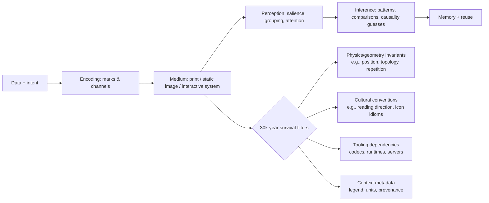

# Information Graphics 30,000 Years From Now

__In art school, a teacher once assigned a task that left an indelible impression on me. It went something like this:__

___
*Imagine you work for a corporation that has discovered a solution to global warming, world hunger, or something equally devastating. The byproduct of the process solving this problem is a giant, toxic waste dump. A board of top minds have been assembled to decide how to dispose the waste: it would be buried deep, deep underground -- so deep, in fact, that it would not be expected to resurface until another 30,000 years passed.  Your job is to design the warning sign for the lid of the dump, to warn the inhabitants of Earth in this distant future. We have no idea what language they will speak, what their culture and customs will be like, or even if they will be human. How would you design a sign that communicates the very important message to not remove the lid of the underground vault?*
___

___Information graphics work best when *structure* is compressed into *perception*.___  The mind is quick to recognize amounts and relationships represented by count, position, and sizing. Left-brain tasks like calculating and analyzing are secondary to what is absorbed intuitively by the right brain, or the part of the mind that senses patterns through visual and spatial cues, and ingests and processes them without conscious effort.  Information graphics that favor this sort intuitive processing are more likely to survive loss of language and culture that will inevitably occur over deep time.

When examining current and historical graphic records, a few strategies for encoding information have endured:

1. ***repetition representing quantities*** _Isotype pictograms_
2. ***spatial positioning to indicate magnitude*** _charts/maps_
3. ***topology showing connection*** _networks_
4. ***descriptive redundancy*** _legends, scales, reference units_

These strategies persevere because they piggyback on an inherent mammalian ability to detect positional difference, to intuit natural grouping, and to sub-consciously recognize symmetry, continuity, and motion. As long as future intelligence retains this same ability, these strategies remain extremely valid. 

##  Graphics for Posterity: Invariants 

An observer of the future 30,000 years from now likely won't care as much what we call our graphics, or how we feel they most pleasantly align with the eye, they will care instead whether the artifact reveals *invariants*, the functions, quantities and properties that remain unchanged after undergoing various transformations. (see _Invariants: The Mathematical Way to Look at the World_,"2019"). Invariants contribute physics to the study of information graphics, adding perceptual and physical properties likely to survive cultural and linguistic change.

Some of the most intriguing examples of invariants are briefly described below.  These examples represent information robustly encoded to be loss-resistent.

### Case Studies 

#### Khipu Trandition, Andean Mountain Range, S.A.

The Andean khipu traditon of using *knotted, tactile, and data-dense records* is documented in UNESCO's _Memory of the World_ database.  It describes an Andean khipu tradition that is also the only surviving record of the Incan empire.  The Incans used knots, cord colors, and structures to record information across multiple objects. It's a system with a high degree of _readability_, depending not on learned conventions but *physical redundancy across multiple material dimensions* to decode.

 "Image Source: Quipu Wikipedia"

#### Marshallese Stick Charts: _Geometric Models for Navigation_

Marshallese “stick charts,” held in collections including, "The M.Marshallese Stick Chart set at Metropolitan Museum of Art","New York, NY, US", encode wave patterns and island relationships in a sparse lattice of sticks and shells. Even after the practice in culture is lost, objects retain a graph-like structure (nodes and relationships), highly suitable for reverse-engineering tactics used by future intelligence. 

#### The Dresden Codex 

The Dresden Codex eclipse table relies on structured sequencing and corrections—evidence as a predictive, model-based information system. Even if glyph semantics are lost in the distant future, periodic structure and error-correction marks could remain legible, functioning as “prediction machinery.”

#### Napoleanic Polar Area Diagrams and Flow Maps 

**The 18th–19th century European canon—time series and bars from Physicist's William Playfair's _polar area diagrams_ and from _flow maps_ like those created by civil engineer and cartographer Charles Joseph Minard", map quantities onto space in ways that don’t require language to produce noticeable patterns like  surges, collapse, asymmetry, and loss.

## ISOTYPE: _Pictorial standardization_
ISOTYPE, developed by Otto Neurath, "the isotype pioneer" and his collaborators, is a system designed to make pictorial representations of “social facts” using consistent symbol rules (e.g., quantity through repetition not scale). 

## Visual Systems for Posterity: Best Principles

A useful 30,000‑year heuristic is: **what can be recovered from the artifact without shared language, shared UI conventions, or shared institutions?** This focuses the goal toward perceptual and physical affordances rather than stylistic or cultural ones.  

### Iconography, marks, and channels

In visualization theory, a recurring theme is encoding information as marks (e.g., points/lines/areas) and channels (position, size, color, etc.). Jacques Bertin, cartographer semiology, imagined a thing he called “visual variables" which included position, size, value/lightness, texture, color/hue, orientation, and shape. His work is influential because it ties design to perceptible differences rather than stylistic preference. 

### Motion and interactivity

Interactivity is powerful but also preservation-hostile because it depends on executable environments. Ben Shneiderman, hci researcher", composed what he dubbed a “visual information-seeking mantra”, which captures the cognitive logic of interactive exploration. In 30,000 years, interactions are likely to be unreplayable unless preserved within software and its environment.

Animation can clarify change when it preserves object constancy. Work on animated transitions (e.g., by entity["people","Jeffrey Heer","computer scientist visualization"] and collaborators) frames principles for using motion to help viewers track correspondences. citeturn4search1turn4search13 For deep time, treat animation as **optional explanation**, never as the only record.

## The Unusual, the concise, the elegant, and the surprising: Techniques to Employ in 2026

This section emphasizes formats that communicate *variable complexity*—a quick gist at first glance, but deeper structure on inspection—while also noting what likely survives wordlessly.

**Micro-visuals as “inline evidence”:** Sparklines compress time-series shape into word-sized marks, allowing local evidence to travel with text/tables. They are unusually durable because a line’s shape reads as “variation over sequence”, even without labels, though the *meaning inherent to the axis* may be lost if units are omitted. 
*Caption:* **Sparkline:** a minimal time-series signature embedded where reading happens.

**Horizon graphs and layered compression:** Horizon graphs fold and color-layer time series to increase density; experiments compare accuracy tradeoffs as size shrinks. This is elegant but semantically fragile: without a legend explaining banding and mirroring, a future reader may only see decorative stripes. 
*Caption:* **Horizon graph:** sacrifices immediate intuitiveness to fit many time series into small vertical space.

**Glyphs exploiting human face-processing:** Chernoff faces map multivariate dimensions to facial features; humans detect differences quickly, but mapping is arbitrary and culturally loaded, when it comes to interpreting what counts as “angry,” “healthy,” or “normal”, for example. This format can reveal clusters, but meaning is highly likely to be lost without explicit mapping metadata. 
*Caption:* **Chernoff faces:** high-bandwidth perceptual channel; low inherent semantics.

**Flow maps and conservation metaphors:** Sankey-like flows exploit the near-physical metaphor that width is equal to quantity flow. They scale from gist (where is the mass?) to detail (specific paths), and survive surprisingly well if arrows are used and proportionality clear. 
*Caption:* **Flow-width encoding:** a “conservation law” picture that often reads even without language.

**Data physicalization: _tactile redundancy_:** Physical representations recruit touch, proprioception, and spatial memory. Research on “data physicalization” provide opportunity and challenge since physical artifacts can improve engagement and help provide context to specific tasks, but are exceptionally hard to version, store, and standardize. For deep time, physicalization can be an advantage when an object’s mapping is self-contained and labeled.
*Caption:* **Physical chart/object:** meaning partly in material constraints; preservation partly in material durability.

**Sonic and multimodal encodings:** Sonification maps data to sound parameters, offering access where visuals fail and enabling detection of temporal patterns. "The Sonification Handbook", written by "Hermann Hunt Neuhoff in 2011" documents field foundations. Multimodal designs persist when paired with a durable specification of mapping and a playable audio format.
*Caption:* **Sonification:** durable as audio files, but mapping semantics must be archived with it.

**AR/VR and immersive analytics (high power, high loss):** Immersive analytics research explicitly explores embodied interaction for sensemaking, but surveys note both promise and practical constraints; preservation is especially fragile because it depends on hardware, runtimes, and interaction models.
*Caption:* **Immersive analytics:** cognitively rich; archivally brittle unless captured as re-playable states + video + specs.

### Failure modes to assume likely  

**Format and platform obsolescence:** Even widely used formats die when tooling dies. The Library of Congress explicitly distinguishes “bit-level preservation” from “long-term usability,” warning that rendability depends on formats and their dependencies.

**Link rot and reference drift:** Scholarly and legal communities have documented “reference rot” (links break; content changes). A well-known study behind Perma, reports very high decay rates in cited URLs in legal and scholarly contexts and provides an empirical warning: that "just linking the source” is not preservation.

**Software-dependent graphics:** Interactive dashboards and web-native narratives cannot be replayed without a software stack. Community efforts including emulation infrastructures and software preservation networks exist precisely because it is a known, systemic risk.

**Silent corruption and authenticity:** Fixity guidance treats bit rot and unnoticed alteration as routine threats, recommending checksum-based monitoring. Replication strategies like “Lots Of Copies Keep Stuff Safe,” embodied by the LOCKSS Program, reduce single-point failures.

### Preservation-friendly containers and standards (practical bias, not ideology)

For web/native contexts, WARC (ISO 28500) exists to store payload + headers + metadata so future replay and auditing are plausible. For documents, PDF/A (ISO 19005 family) constrains features (e.g., embedded fonts, no external dependencies) to improve long-term reproducibility. For images and vectors, durability correlates with open, well-specified standards like PNG (ISO/IEC 15948) and SVG (W3C specification history), assuming you also preserve profiles, fonts, and rendering intent.

Finally, for software-dependent graphics that must be preserved, treat emulation as first-class: programs like EaaSI led by Yale University Library partners exist to scale emulated access to obsolete environments.

## Practical user guide for designers and archivists in 2026

### Guidelines

1. **Make graphics self-describing at three levels:**
   *Immediate*: what is being compared; 
   *Operationa*: how to read date (e.g., legend, units, scales) 
   *Provenance*: where data came from, when captured, and what transformations occurred. OAIS thinking is useful here: preservation needs representation information, not just files. citeturn0search3turn0search15

2. **Default to encodings that survive perception without training:**
   Prefer position on common scales, ordering, adjacency, and topology for core comparisons; use angles/areas only with redundancy and when precision is not the goal. citeturn0search2turn0search10

3. **Assume color semantics will be misunderstood:**
   Use color for grouping, not for single-channel meaning. Always add a non-color redundancy (shape, texture, labels), and account for widespread red–green deficiencies.

4. **Exploit “gist-first, depth-later” structures:**
   Favor designs that offer an immediate gestalt (trend, cluster, outlier) but preserve detail for inspection: small multiples, sparklines, and well-labeled dense displays do this well.

5. **Use metaphors that are physically grounded, not culturally fashionable:**
   Flow-width proportionality, containment, proximity, and symmetry are safer than memes, UI-specific iconography, or platform metaphors.

6. **Treat motion as annotation, not as storage:**
   If you animate, archive a static “keyframe set” and a written mapping/spec. Animated transitions can help interpretation now, but are too fragile to be the only record.

7. **Preserve interaction in layers:**
   If the work is interactive, capture: (a) a static canonical view, (b) a narrated screen recording of intended use, (c) exported data + schema, (d) code + build instructions, (e) an emulatable environment when feasible. This aligns with modern software preservation practice. 

8. **Choose open, widely specified formats as the archival master:**
   Use WARC for web captures, PDF/A for documents, PNG/TIFF for raster masters, SVG for vectors when you can control dependencies (fonts, external CSS/JS). 

9. **Bake in redundancy against cultural context loss:**
   Include numeric anchors (example values), miniature keys, and a “Rosetta strip” that shows the same data in two encodings (e.g., table + plot). Redundancy is what future intelligences will use to triangulate meaning.

### Likely to persist vs likely to be lost

| Likely to Persist (with reasons) | Likely to Be Lost (with reasons) |
|---|---|
| **Spatial comparisons using aligned position** — leverages geometry and robust perception. citeturn0search2 | **Chart-type conventions without legends** — “this is a boxplot” or “this is a violin plot” is culturally learned; without explanation it becomes abstract decoration. citeturn10search4 |
| **Repetition for quantity (tally/pictogram counts)** — counting/accumulation is near-universal; ISOTYPE formalized this. citeturn1search4turn1search8 | **Color-as-semantics (red=bad/green=good)** — culturally variable and biologically inaccessible to many viewers; also unstable across display media. citeturn7search3 |
| **Topology and networks (nodes/links), physical lattices** — structure survives even if labels don’t (e.g., stick charts). citeturn2search7turn2search4 | **Emoji/icon idioms and UI glyphs** — meaning depends on platform-era conventions and often short-lived pop culture. |
| **Physically grounded metaphors (flow width, containment, proximity)** — can be reverse-engineered from invariants. citeturn10search26 | **Highly compressed encodings without decoding rules** (e.g., horizon graphs without band explanation) — compactness increases dependence on conventions. citeturn4search6 |
| **Self-contained standards-focused artifacts (PDF/A, WARC) + metadata** — engineered for long-term re-rendering and context. citeturn6search7turn6search14 | **Purely interactive, server-backed dashboards** — dependencies on runtimes, APIs, and hardware; high probability of irrecoverable behavior. citeturn8search1turn8search2 |
| **Redundant multi-modal records (image + text + data + units)** — multiple hooks let future readers triangulate meaning. citeturn0search15 | **Link-only citations to web sources** — documented link rot/content drift makes “just link it” a predictable failure. citeturn11search35turn11search19 |

### Speculative 30,000‑year interpretation scenarios

**Scenario: The archive as a fossilized UI.** A future intelligence recovers a WARC of a 2026 web-based dashboard but cannot execute the JavaScript environment. The only intelligible parts are static thumbnails, embedded CSV exports, and any preserved “about/legend” text. If you archived interaction only as behavior (code), it is dead; if you archived it as *state snapshots + narrative screen capture + data schema*, it becomes reconstructible.

**Scenario: Physics beats culture.** They find the entity["album","Voyager Golden Record","1977"] cover diagrams from entity["organization","NASA","us space agency, washington, dc"] explaining playback and Earth’s location via the hydrogen hyperfine transition and pulsar map. Even if “humans” are unknown, the artifact anchors units to physical constants and uses redundancy—a deliberate attempt at wordless scientific communication. This is a template for deep-time infographics: reference to invariants + explicit decode steps. 

**Scenario: Fear without semantics.** They discover nuclear-waste warning research (designed for ~10,000 years) recommending multi-level messages: immediate “something dangerous,” then progressively more detailed explanations. The lesson is uncomfortable but practical: deep-time messaging often needs an affective layer (salience/avoidance) plus a technical layer (explanation), because one without the other can fail. 